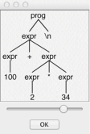

## 第一章 初识ANTLR

>ANTLR是使用Java语言编写的，因此你需要首先安装Java，哪怕你的目标是使用ANTLR来生成其他语言（如C#和C++）的
>解析器。（我希望在不远的未来ANTLR可以支持更多的语言）ANTLR运行所需的Java版本为1.6或更高。

>注：ANTLR现已经支持多种语言。

### 1.1 安装ANTLR

>1.下载ANTLR
* 网址：https://www.antlr.org/
```text
 $ cd /usr/local/lib
 $ wget https://www.antlr.org/download/antlr-4.7.1-complete.jar
```
>2.配置环境变量

```text
 $ export CLASSPATH=".:/usr/local/lib/antlr-4.7.1-complete.jar:$CLASSPATH"
```

>3.设置别名

```text
$ alias antlr4='java -jar /usr/local/lib/antlr-4.7.1-complete.jar'
$ alias grun='java org.antlr.v4.gui.TestRig'
```

>4.测试安装成功与否

* 直接输入antlr4、grun命令。

### 1.2 运行ANTLR并测试识别程序

>1.语法文件如下所示（Expr.g4）
```g4
grammar Expr;		
prog:	(expr NEWLINE)* ;
expr:	expr ('*'|'/') expr
    |	expr ('+'|'-') expr
    |	INT
    |	'(' expr ')'
    ;
NEWLINE : [\r\n]+ ;
INT     : [0-9]+ ;
```

>2.解析语法文件自动生成源码

```text
$ antlr4 Expr.g4
$ javac Expr*.java
$ grun Expr prog -gui
100+2*34
^D
```

>3.gui运行截图

